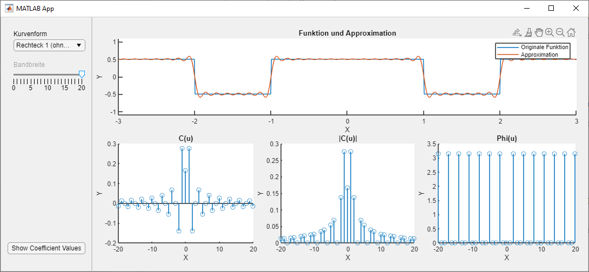
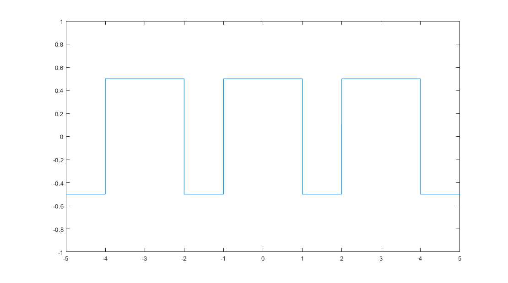
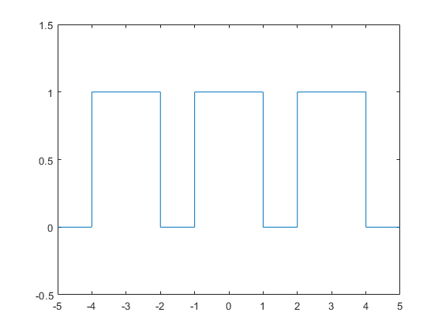

# Fourier Synthesis Demo App with Coefficient Visual Display
Fourier Synthesis Demo App with Coefficient Display



Because of limitations regarding redistribution of code/functionality contained in the Symbolic Math Toolbox this app doesn't do coefficient calculation in real time. Working around the limitations leads to pre-calculated Fourier Coefficients being used. So we need to pre-calculate the coefficients (see steps below).  
Since this is more of a teaching tool that limitation is not a deal breaker. But you should be aware of it.  
We're doing signals (and systems), that's why there is no units (at least on the y-axis). Imagine this being some voltage having been normalized to a maximum amplitude of "1".

# How Fourier Coefficients / Functions are prepared  
- Set up Matlab for symbolic computation of Fourier Coefficients: 
```
syms x k L n
evalin(symengine,'assume(k,Type::Integer)');
```  
- Define function that is to be approxiated:


```
% rectangular pulse train without dc offset
% amplitude between -.5 and +.5
f = rectangularPulse(-1,1,x)  + rectangularPulse(-1,1,x-3) + rectangularPulse(-1,1,x+3) -.5;
% Save function to Matlab file for later use in the app:
matlabFunction(f,'File','rectangular_1')
```

- Define functions for symbolic coefficient calculation: 
```
% complex coefficients
c = @(f,x,k,L) 1/(2*L) * int( f * exp(-j*2*pi*k*x/(2*L))  , x,-L,L);
```

- Define symbolic sum (n-th order) approximating the original function (sawtooth pulse train):
```
% fc is computation via complex coefficients
% this is not als slick as it could be 
% symsum will fail at k=0 when running k from -n..+n
% so we split the computation into three parts (negative, zero, positive)
fc = @(f,x,n,L) symsum( c(f,x,k,L)* exp(j*k*2*pi*x/(2*L)) ,k,1,n)+ symsum( c(f,x,k,L)* exp(j*k*2*pi*x/(2*L)) ,k,-n,-1) + c(f,x,0,L)*exp(j*0*2*pi*x/(2*L));
```

- Do a quick check of the computations:
```
% tbd
```

- Pre-compute Fourier Coefficients up to order 20:
```
% compute complex fourier coefficients for pulse trains
% this one makes for 41 coefficients in total (-20..0..20)
for R = -20:20
 rect_c(R+21) = c(f,x,R,1.5); 
end

% Save to Matlab function file ('.m')
matlabFunction(rect_c,'File','koeff_rectangular_1_c')
```

- Save Latex string for later display in app:
```
% one coefficient per line
% complex coefficients
fid = fopen('rectangular_1_c_lstr.txt','wt');
for R=1:41
  fprintf(fid, '%s \n', latex(rectangular_1_c(R)));
end
fclose(fid)
```

- Now, there's Fourier Coefficients (complex) up to order 20 and the original function in a file for later use in the app.

# Implemented Functions
## Rectangular 1
Rectangular Pulse Train without DC Offset.  


```
f = rectangularPulse(-1,1,x)  + rectangularPulse(-1,1,x-3) + rectangularPulse(-1,1,x+3) -.5;
```
Period is 3.

## Rectangular 2
Rectangular Pulse Train with DC Offset.  


```
f = rectangularPulse(-1,1,x)  + rectangularPulse(-1,1,x-3) + rectangularPulse(-1,1,x+3);
```
Period is 3.

