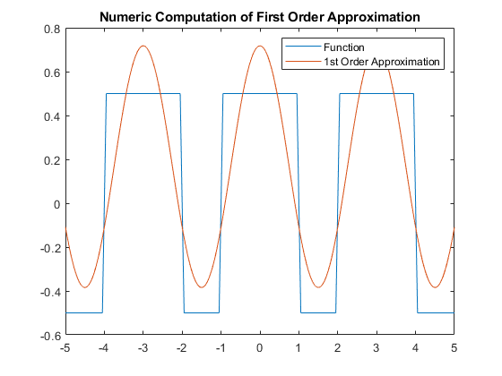

# Fourier Synthesis Demo App with Coefficient Visual Display
Fourier Synthesis Demo App with Coefficient Display


Because of limitations regarding redistribution of code/functionality contained in the Symbolic Math Toolbox this app doesn't do coefficient calculation in real time. Working around the limitations leads to pre-calculated Fourier Coefficients being used. So we need to pre-calculate the coefficients (see steps below).  
And yes, the functions/pulse trains are not running from t=-inf to t=+inf. 

Since this is more of a teaching tool these limitations are not a deal breaker. But you should be aware of it.  
We're doing signals (and systems), that's why there is no units (at least on the y-axis). Imagine this being some voltage having been normalized to a maximum amplitude of "1".

# How Fourier Coefficients / Functions are prepared 
This (unintentionally) turned into a nice run-down of using Matlab for Complex Fourier Series Computation. See the other App Repo (FourierSynthesis) for Real Coefficients (a-b-fashion with Cosine and Sine). 

- Set up Matlab for symbolic computation of Fourier Coefficients: 
```
syms x k L n
evalin(symengine,'assume(k,Type::Integer)');
```  
- Define function that is to be approxiated:


```
% rectangular pulse train without dc offset
% amplitude between -.5 and +.5
f = rectangularPulse(-1,1,x)  + rectangularPulse(-1,1,x-3) + rectangularPulse(-1,1,x+3) -.5;
% Save function to Matlab file for later use in the app:
matlabFunction(f,'File','rectangular_1')
```

- Define function for symbolic coefficient calculation: 
```
% complex coefficients
c = @(f,x,k,L) 1/(2*L) * int( f * exp(-j*2*pi*k*x/(2*L))  , x,-L,L);
```

- Define symbolic sum (n-th order) approximating the original function (pulse train):
```
% fc is computation via complex coefficients
% this is not als slick as it could be 
% symsum will fail at k=0 when running k from -n..+n
% so we split the computation into three parts (negative, zero, positive)
fc = @(f,x,n,L) symsum( c(f,x,k,L)* exp(j*k*2*pi*x/(2*L)) ,k,1,n)+ symsum( c(f,x,k,L)* exp(j*k*2*pi*x/(2*L)) ,k,-n,-1) + c(f,x,0,L)*exp(j*0*2*pi*x/(2*L));
```

- Pre-compute Fourier Coefficients up to order 20:
```
% compute complex fourier coefficients for pulse trains
% this one makes for 41 coefficients in total (-20..0..20)
for R = -20:20
 rect_c(R+21) = c(f,x,R,1.5); 
end

% Save to Matlab function file ('.m')
matlabFunction(rect_c,'File','koeff_rectangular_1_c')
```

- Do a quick check of the computations:

  
```
% plot complex coefficients 
figure;stem([-20:20],rect_c)
```

  
```
% symbolic calculation of approximating function fc
figure;fplot(fc(f,x,2,1.5)), hold on, fplot(f), hold off
legend("2nd Order Approximation","Function")
```


  
```
% quick manual computation of numeric first order approximation
% create time vector
tv = [-5:0.05:5];
% create numeric (matlab) function of pulse train
rect_1 = matlabFunction(f)
% manual summing, 
% rect_c(21) is coefficient #0,
% rect_c(20) is coefficient #-1
% rect_c(22) is coefficient #1
% and we know that our rectangular pulse train has a period of T=3
sn = rect_c(21) *exp(1i*2*pi*0*tv/3) + rect_c(20) *exp(1i*2*pi*-1*tv/3) +rect_c(22) *exp(1i*2*pi*1*tv/3)
% plot original function and manually summed first order approximation
figure;plot(tv,rect_1(tv)), hold on, plot(tv, sn), hold off
title("Numeric Computation of First Order Approximation")
legend("Function", "1st Order Approximation")

```


 
```
% do a full computation taking all (41) coefficients
% as close to 42 as it gets ;)
% we'll notice artifacts from loss of precision
% one symptom thereof will be plot complaining
% about not being able to display imaginary arguments...
% these imaginary parts result from numeric imprecision when
% doing coefficient conversion from symbolic to double
% sn means sum, numeric
sn = 0;
for R = 1:41
 sn = sn + double(rect_c(R))* exp(1i*2*pi*(R-21)*tv/3);
end
figure;plot(tv,sn), hold on, plot(tv, rect_1(tv)), hold off;
legend("20th Order Numeric Approximation", "Function")
title("Numeric Approximation, 20th Order")
```

 
```
% looks better, huh?
figure;fplot(f),hold on, fplot(fc(f,x,20,1.5)),hold off
title("Symbolic Approximation, 20th Order")
legend("Function", "20th Order Numeric Approximation")
```

- Save Latex string for later display in app:
```
% one coefficient per line
% complex coefficients
fid = fopen('rectangular_1_c_lstr.txt','wt');
for R=1:41
  fprintf(fid, '%s \n', latex(rectangular_1_c(R)));
end
fclose(fid)
```

- Now, there's Fourier Coefficients (complex) up to order 20 and the original function in a file for later use in the app.

# Implemented Functions
## Rectangular 1
Rectangular Pulse Train without DC Offset.  


```
f = rectangularPulse(-1,1,x)  + rectangularPulse(-1,1,x-3) + rectangularPulse(-1,1,x+3) -.5;
```
Period is 3.

## Rectangular 2
Rectangular Pulse Train with DC Offset.  


```
f = rectangularPulse(-1,1,x)  + rectangularPulse(-1,1,x-3) + rectangularPulse(-1,1,x+3);
```
Period is 3.

